Adrián Sánchez Rodríguez

# Manual de configuración de Nextcloud

## Creación de la cuenta de administrador

1. Creamos el usuario de administrador y introducimos una contraseña:

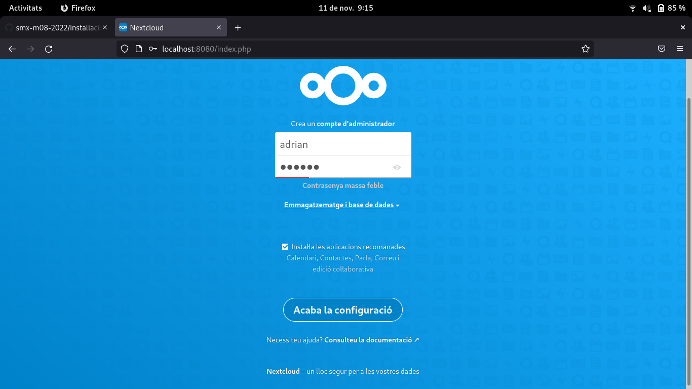

2. En la parte de abajo de la configuración introducimos el usuario, la contraseña y el nombre de la base de datos que hemos creado en la instalación de mysql. Una vez ya hemos introducido los datos le damos a `Acaba la configuració`

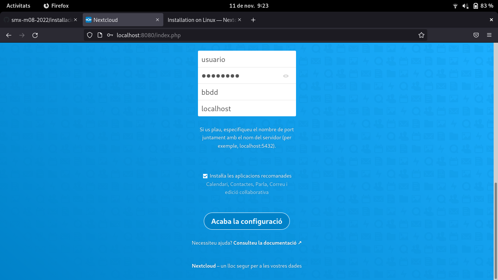

3. Esperamos a que se acaben de instalar las aplicaciones:

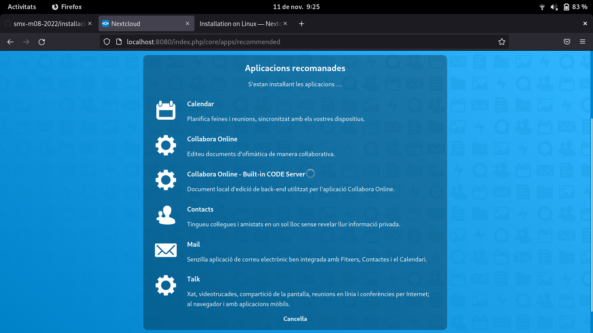

## Creación de un usuario nuevo

1. Hacmeos clic sobre el icono de nuestro perfil, que se encuentra arriba a la derecha, y luego le damos a `Usuaris`

  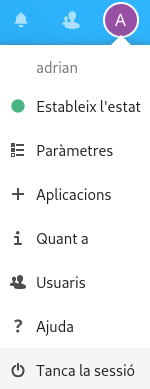

2. Una vez en usuaris, le damos a `Nou usuari`

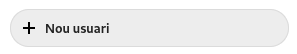

3. Introducimos todos los datos y cuando ya los tengamos le damos a `Afegeix un nou usuari`

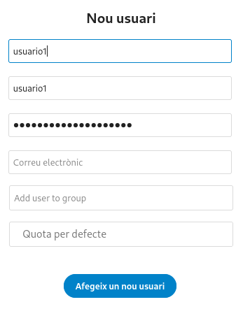

### Añadir un usuario a un grupo y editar los parámetros de un usuario

1. Nos vamos al apartado `Usuaris` (igual que en el punto anterior de crear usuarios).

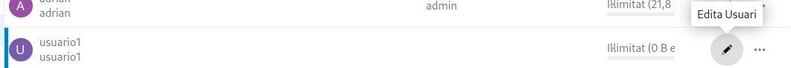

2. Aquí podemos cambiar varios parámetros, entre los que se encuentran añadirle una nueva contraseña, añadir un correo electrónico, añadir el usuario a un grupo y asignar el espacio disponible que tiene ese usuario.

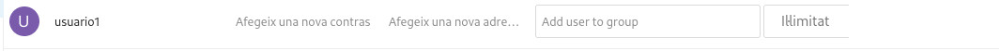

## Creación de grupos

1. Hacmeos clic sobre el icono de nuestro perfil, que se encuentra arriba a la derecha, y luego le damos a `Usuaris`

  

2. Una vez en usuaris, le damos a `Afegeix un grup`.

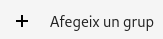

3. Introducimos el nombre del grupo:

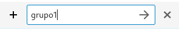

## Administración de archivos
### Crear o subir archivos
1. Nos vamos al apartado `Fitxers`.

2. Para crear o subir un archivo lo que hay que hacer es darle al símbolo de `+`, que se encuentra en la parte de arriba.

3. Una vez ya le hemos dado al `+`, ahora tenemos que decidir lo que vamos a hacer, si crear un archivo (documento, hoja de cálculo, presentación...) o si vamos a subir un archivo desde nuestra máquina. Dependiendo de lo que vayamos a hacer seleccionamos una u otra opción.

  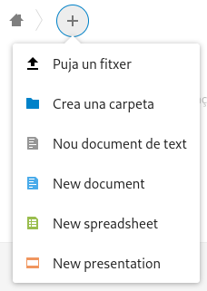
