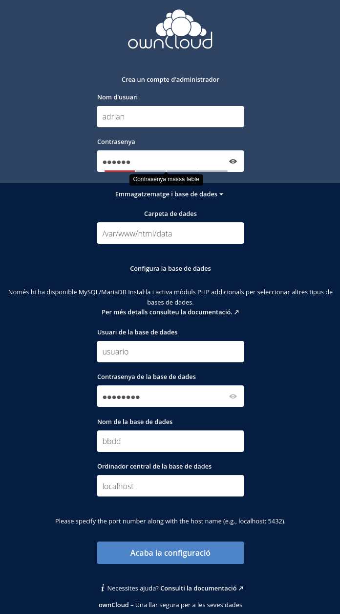
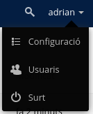
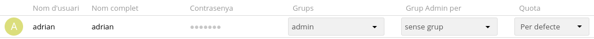
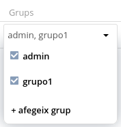
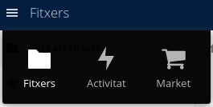
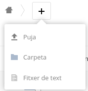
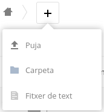
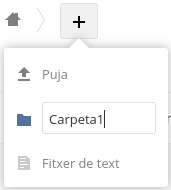

Adrián Sánchez Rodríguez

# Manual de configuración de OwnCloud

## Creación de la cuenta de administrador

1. Creamos el usuario de administrador y introducimos una contraseña. En la parte de abajo de la configuración introducimos el usuario, la contraseña y el nombre de la base de datos que hemos creado en la instalación de mysql. Una vez ya hemos introducido los datos le damos a `Acaba la configuració`.

## Creación de un usuario nuevo
1. Hacemos clic en el nombre de nuestro usuario y luego en `Usuaris`.

2. En la parte de arriba introducimos los datos que nos pide, que son los siguientes:
- Nombre.
- Correo.
- Grupos a los que queremos añadir al usuario.

## Creación de un grupo nuevo
1. Hacemos clic en el nombre de nuestro usuario y luego en `Usuaris`.

2. En la parte izquierda le damos a `+ Afegeix grup`.

3. Ponemos el nombre que queremos al grupo y le damos al `+`:

## Añadir un usuario a un grupo
1. Nos vamos al apartado `Usuaris`. Para ello hacemos clic en el nombre de nuestro usuario y luego en `Usuaris`.

2. Una vez en `Usuaris`, seleccionamos el usuario el cual queremos añadir a un grupo, en mi caso será el usuario `adrian`.

3. Le damos a `Grups`y luego seleccionamos los grupos a los que queremos añadir al usuario:

  

## Subir un fichero
Para subir un fichero hay que hacer lo siguiente:
1. Nos vamos al apartado `Fitxers`. Para ello le damos a las 3 barras de arriba a la izquierda y seleccionamos `Fitxers`.

2. Le damos al `+`, después a `Puja` y luego seleccionamos el fichero a subir.

  

## Crear una carpeta
Para subir una carpeta lo que hay que hacer es lo siguiente:
1. Nos vamos al apartado `Fitxers`. Para ello le damos a las 3 barras de arriba a la izquierda y seleccionamos `Fitxers`.

2. Le damos al `+`, después a `Carpeta`.

  

3. Ponemos nombre de la carpeta y le damos al enter

## Compartir un fichero o carpeta
1. Nos vamos al apartado `Fitxers`. Para ello le damos a las 3 barras de arriba a la izquierda y seleccionamos `Fitxers`.

2. Seleccionamos el fichero o carpeta que queremos compartir y le damos al símbolo de compartir.

  

3. Seleccionamos los usuarios y/o grupos con los que queremos compartir un fichero o una carpeta:

