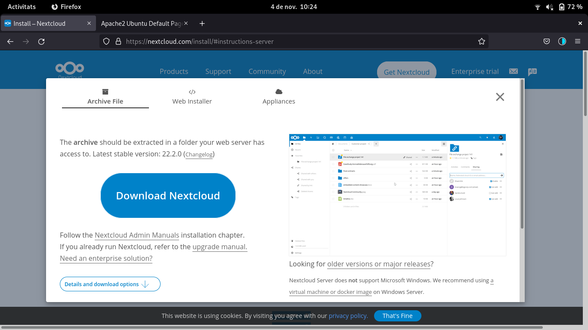

Adrián Sánchez Rodríguez

# Manual de instalación de Nextcloud

 1. Lo primero que hay que hacer es descargar Nextcloud. Para ello accedemos a https://nextcloud.com/install/#instructions-server y le damos a Download Nextcloud.

2. Movemos el fichero que nos hemos descargargado a la carpeta donde esta vagrant, que por así decirlo es como una carpeta compartida entre la máquina local y la virtual. En mi caso lo pasaré de Baixades a la carpeta clouds, que es donde tengo el vagrant.
~~~
  [asanchezrodriguez@alumne-1-36 ~]$ cd Baixades/
  [asanchezrodriguez@alumne-1-36 Baixades]$ mv nextcloud-22.2.0.zip
  [asanchezrodriguez@alumne-1-36 Baixades]$ mv nextcloud-22.2.0.zip /home/asanchezrodriguez/clouds
~~~

3. Desde la carpeta donde tengamos el vagrant, en mi caso clouds, lo movemos a /var/www/html.
~~~
[asanchezrodriguez@alumne-1-36 clouds]$ mv nextcloud-22.2.0.zip /Vagrantfile/var/www/html
~~~

4. Ahora lo que tenemos que hacer es `vagrant ssh` si no lo hemos hecho antes, después hay que instalar un paquete para poder descomprimir el archivo:
~~~
  vagrant@ubuntu-focal:~$ sudo -s
  root@ubuntu-focal:/home/vagrant# apt update
  root@ubuntu-focal:/home/vagrant# apt install unzip
~~~

5. Ahora hay que descomprimir el archivo:
~~~
root@ubuntu-focal:/var/www/html# unzip nextcloud-22.2.0.zip
~~~

6. Una vez decomprimido el archivo eliminamos la carpeta zip y el index.html:
~~~
root@ubuntu-focal:/var/www/html# rm index.html
root@ubuntu-focal:/var/www/html# rm nextcloud-22.2.0.zip
~~~

7. Copiamos la carpeta al directorio superior y una vez allí sacamos el archivo y eliminamos la carpeta.
~~~
root@ubuntu-focal:/var/www/html# cp -R nextcloud/. .
root@ubuntu-focal:/var/www/html# cd ..
root@ubuntu-focal:/var/www# cp -R nextcloud/. .
root@ubuntu-focal:/var/www# rm -rf nextcloud
~~~

8. Cambiamos los permisos y el propietario:
~~~
root@ubuntu-focal:/var/www# chmod -R 775 .
root@ubuntu-focal:/var/www# chown -R root:www-data .
~~~

9. Una vez ya hemos hecho lo anterior lo que vamos a hacer es instalar varios paquetes, entre los que se encuentran apache2 y mysql-server entre otros:
~~~
root@ubuntu-focal:/home/vagrant# apt update
root@ubuntu-focal:/home/vagrant# apt upgrade
root@ubuntu-focal:/home/vagrant# apt install -y apache2
root@ubuntu-focal:/home/vagrant# apt install -y mysql-server
root@ubuntu-focal:/home/vagrant# apt install php libapache2-mod-php
root@ubuntu-focal:/home/vagrant# apt install php-fpm php-common php-mbstring php-xmlrpc php-soap php-gd php-xml php-intl php-mysql php-cli php-ldap php-zip php-curl
~~~

10. Creamos la base de datos:
~~~
root@ubuntu-focal:/home/vagrant# CREATE DATABASE bbdd;
~~~

11. Creamos el usuario:
~~~
CREATE USER 'usuario'@'localhost' IDENTIFIED WITH mysql_native_password BY 'password';
~~~

12. Damos permisos al usuario:
~~~
GRANT ALL ON bbdd.* to 'usuario'@'localhost';
~~~
